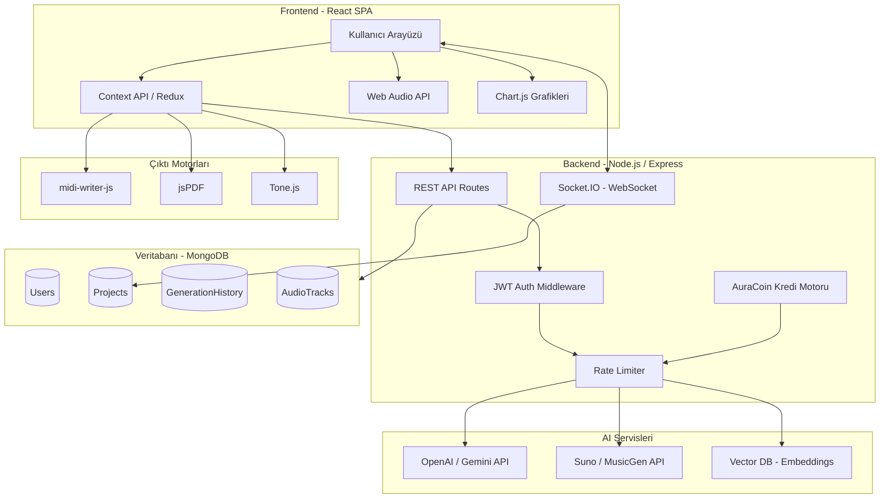

# YMH354 MÜHENDİSLİK PROJESİ FINAL RAPORU

**PROJE ADI:** AuraBeat – Yapay Zeka Destekli Dijital Müzik Asistanı
**DERS:** YMH354
**TARİH:** Mart 2026

---

## ÖZET (ABSTRACT)
Bu proje raporu, müzik üreticilerinin ve bestecilerin yaratım süreçlerini hızlandırmak, tıkandıkları noktalarda yapay zeka desteğiyle ilham sağlamak amacıyla geliştirilen "AuraBeat" platformunun tasarım, mimari ve teknik detaylarını sunmaktadır. Proje; akor zinciri oluşturma, şarkı sözü yazımı, müzikal altyapı (iskelet) hazırlama ve metinden/parametrelerden doğrudan ses (audio) üretme yeteneklerini tek bir entegre sistemde birleştirerek, son kullanıcılara uçtan uca, analitik verilerle desteklenmiş bir müzik prodüksiyon deneyimi sunmayı hedeflemektedir.

---

## 1. GİRİŞ VE PROBLEM TANIMI

Müzik prodüksiyonu, hem müzik teorisi bilgisi (akorlar, gamlar, ritmik yapılar) hem de yaratıcı süreçlerin (söz yazımı, beste yapma) aynı anda işletilmesini gerektiren kompleks bir süreçtir. Geliştiriciler, müzisyenler ve medya içerik üreticileri sıklıkla "yaratıcı tıkanıklık" (writer's block) adı verilen ilham eksikliği durumlarıyla karşılaşmaktadır. 

Mevcut çözümler genellikle parçalıdır; örneğin akor bulmak için ayrı bir yazılım, metronom için ayrı bir araç, yapay zeka tabanlı söz veya ses üretimi için ise birbirinden farklı web siteleri kullanılmaktadır. Bu parçalı yapı iş akışını yavaşlatmakta ve yaratıcılığı bölmektedir. 

**Amaç:** AuraBeat projesinin temel amacı, dağınık durumdaki tüm müzikal araçları (toolbox), yapay zeka destekli jeneratif modelleri (metin, akor ve ses) ve profesyonel çıktı formatlarını (MIDI, PDF) güçlü bir "Kullanıcı Gösterge Paneli" (Dashboard) etrafında birleştiren merkezi bir platform geliştirmektir.

---

## 2. PROJE KAPSAMI VE HEDEF KİTLE

Projenin kapsamı, kullanıcının sisteme giriş yapmasından başlayarak, kendi müzik planlarını/projelerini oluşturduğu, yapay zeka destekli akor ve söz asistanlarını kullanarak bestesini şekillendirdiği ve nihai ürünü dinleyip/indirip/paylaştığı süreçleri içerir.

**Hedef Kitle:**
1. **Profesyonel Müzisyenler ve Yapımcılar:** Yeni fikirler ve demolar (blueprint) elde etmek isteyenler.
2. **Oyun ve Medya Geliştiricileri:** Projeleri (örneğin low-poly bir oyun) için hızlı veya özel bağlama (Context Mode) uygun arka plan müzikleri arayanlar.
3. **Amatör ve Bağımsız (Indie) Sanatçılar:** Müzik teorisi ve prodüksiyon (Mixing/Mastering) ipuçlarına ihtiyaç duyanlar.
4. **Söz Yazarları:** Kafiye şeması, hece ölçüsü ve yeniden yazım (re-write) gibi asistanlara ihtiyaç duyanlar.

---

## 3. SİSTEM MİMARİSİ VE TEKNOLOJİ YIĞINI (TECH STACK)

Sistem, yüksek erişilebilirlik, anlık veri akışı ve esnek ölçeklenebilirlik prensipleriyle modern bir web mimarisi üzerinde kurgulanmıştır.

* **Frontend (İstemci):** Uygulamanın kullanıcı arayüzü bileşen tabanlı **React** kütüphanesi ile geliştirilmiştir. SPA (Single Page Application) yapısıyla sayfa yenilenmeleri sıfıra indirilmiş, durum yönetimi için Context API (veya Redux) kullanılmıştır.
* **Backend (Sunucu):** API isteklerini, kimlik doğrulama süreçleri ve veritabanı işlemlerini yönetmek için **Node.js** ve **Express.js** çerçevesi (framework) tercih edilmiştir.
* **Veritabanı:** Kullanıcı hesapları, projeler, geçmiş üretimler ve dashboard istatistikleri, belge tabanlı (NoSQL) esnek yapısı nedeniyle **MongoDB**'de saklanmaktadır.
* **Kimlik Doğrulama (Auth):** Güvenlik için **JWT (JSON Web Token)** tabanlı bir erişim sistemi kurulmuştur.
* **Yapay Zeka Servisleri (AI Services):**
    * *Metin ve Yapı:* Gemini veya OpenAI API (Akor zinciri, şarkı sözü, müzik planı ve "Mixing Tips" jenerasyonu).
    * *Gerçek Ses Üretimi:* Suno API, MusicGen veya Udio entegrasyonu (Metin/Parametre verisinden doğrudan MP3/WAV üretimi).
* **Dışa Aktarım (Export) ve Ses Motorları:** 
    * Ses çalma ve görselleştirme için **Web Audio API** ve **Tone.js**.
    * MIDI dosyası üretmek için **midi-writer-js**.
    * Planların raporlanması için **jsPDF**.

### Mimari Diyagram

---

## 4. TEMEL MODÜLLER VE KAPSAMLI İŞLEVSEL ÖZELLİKLER

Proje, birbirleriyle asenkron olarak haberleşen ve entegre çalışan 6 gelişmiş mühendislik modülü etrafında şekillenmiştir. Özellikler, basit bir kullanıcı etkileşiminden ziyade derinlemesine bir prodüksiyon standardı sunmak üzere kurgulanmıştır.

> **Not:** Platformdaki tüm AI destekli işlemler sınırsız değildir; site içi sanal birim olan **AuraCoin (AC)** ile ücretlendirilir. Detaylar için bkz. Bölüm 4.9.

### 4.1. Gelişmiş Kullanıcı Dashboard'u ve Kişiselleştirilmiş Analitik
Sisteme (Register/Login) giriş yapan her kullanıcı için sadece bir kayıt ekranı değil, aynı zamanda detaylı bir **Veri Analitiği Paneli (Data Analytics Board)** oluşturulur.
* **Dinamik Veri Görselleştirme:** Kullanıcının API üzerinde ne kadar yük oluşturduğu; Prompt (Girdi) ve Completion (Çıktı) bazlı token harcamaları Chart.js metrikleriyle (Pasta ve Bar grafikler) gerçek zamanlı hesaplanır.
* **Trend İzleme ve Raporlama:** Zaman tabanlı üretim trendleri (Line chart ile son 7/30 gün) ve sık kullanılan duygu/tür (Mood/Genre) matrisleri gösterilir.
* **Proje Arşivi (History) ve Referans Sistemi:** "Projelerim" veya "Geçmiş" sekmeleri üzerinden çok boyutlu filtreleme algoritmaları (türe, tarihe, API modeline göre) çalıştırılarak eski üretimlere saliseler içinde ulaşılabilir. Favori sistemi ile taslaklar anında stüdyo ortamına geri çağrılabilir.

### 4.2. Algoritmik Müzik İskeleti (Blueprint) Motoru
Kullanıcının belirlediği "Tür" (Genre) ve "Duygu" (Mood) parametreleri, backend üzerindeki mantıksal katmanda işlenerek, yapısal bir iskelete dönüştürülür.
* **Akıllı Gam ve Tempo Ataması:** Seçilen varyasyonlara göre veri tabanından en uygun BPM aralığı, Müzikal Gam (Scale) ve Armonik Dizilim matematiksel olarak oluşturulur.
* **Zenginleştirilmiş Enstrüman Paleti (Role-Based Allocation):** Sadece "gitar ve davul" değil; Lead, Rhythm, Bass ve Atmosferik Pad'ler olmak üzere frekans çakışmasını engelleyecek katmanlı bir orkestrasyon planı sunar.
* **Bağlam Odaklı Generatif Mod (Context Mode):** Müzik planlarını spesifik medya senaryolarına (örn. Kampüs temalı koşu oyunu, Sinematik korku fragmanı) bağlayarak, medya geliştiricilerine saniyeler içinde sektörel "moodboard" üretir.
* **AI Mixing & Mastering Yönergeleri:** Tarza özel profesyonel frekans kesimleri (EQ), Sıkıştırma (Dynamic Range Compression), Panning (Stereo alan yerleşimi) ve Reverb/Delay (Zaman bazlı efekt) parametrelerinde mühendislik seviyesinde tavsiyeler verir.

### 4.3. "Stateful" İnteraktif İş Akışları (Next-Chord & Lyrics Assistant)
Sistemin en yenilikçi tarafı, kullanıcının sisteme sadece komut vermemesi, sistemle "karşılıklı diyalog" halinde kalabilmesidir (Stateful Interaction):
* **İnteraktif Akor Tahmin Algoritması (Next-Chord Predictor):** Kullanıcıya bir kök akor verilir ve "+" ikonuna basıldığında karmaşık Markov Zinciri benzeri bir yaklaşımla "Sıradaki armonik olarak en uygun 3 akor" geçiş ihtimalleriyle birlikte (Örn: "Daha karanlık bir disonans için Minor 7-b5") sunulur.
* **Kısıtlı Ritim ve Hece Asistanı (Constraint-Based Generation):** Ritim ve hece sayısına dayalı, AABB/ABAB gibi önceden tanımlanmış katı kafiye şemalarında (Rhyme Scheme) metin üretimi. 
* **Mikro-Satır Yenileme (Granular Re-write):** LLM (Büyük Dil Modelleri) kullanımıyla, kullanıcının şarkı sözünde bağlamı (context) kaybetmeden sadece seçili olan tek bir cümleyi veya kelime grubunu yeniden oluşturmasını sağlayan mikro-komut özelliği.
* **A/B Karşılaştırma Modülü (Split-View):** İki farklı üretim varyasyonu yan yana getirilerek ritmik ve müzikal farkların (Diff-check) grafik arayüzünde kolayca analiz edilmesi sağlanır.

### 4.4. Gerçek Ses (Audio) Üretimi ve Sinyal İşleme
* **Prompt Mühendisliği (Prompt-to-Music Pipeline):** UI üzerindeki estetik butonlar ve kaydırıcılar (sliders), arka planda özel ayrıştırıcılarla (parser) zengin, optimize edilmiş, modele doğrudan verilebilecek standartlaştırılmış bir "Master Prompt" metnine dönüştürülür.
* **Model Entegrasyonu:** Suno API / Udio altyapısı ile asenkron olarak (long-polling veya webhooks üzerinden) tam dinlenebilir stüdyo kalitesinde gerçek ses dosyaları (.mp3/.wav) elde edilir.
* **Akıllı Ses Ayrıştırma (AI Stem Separation):** Üretilen nihai miksaj dosyasını (audio file) "Vokal, Davul, Bas ve Diğer" olmak üzere 4 ana kanala (stems) bölebilen makine öğrenmesi modeli entegrasyonu. Bu sayede kullanıcılar sadece vokali veya sadece davulu bağımsız olarak indirebilir.
* **Web Audio API Entegrasyonu:** Dönen bu ses doyaları sıradan bir `<audio>` etiketiyle değil, Web Audio API üzerinden geçirilerek frekans analizine (FFT - Fast Fourier Transform) tabi tutulur ve UI üzerinde etkileşimli Waveform (Dalga boyu) görselleştirmesi oluşturulur.

### 4.5. Profesyonel Müzisyen Araç Seti (Toolbox) ve Giriş Sistemleri
* **Audio-to-MIDI ve Mırıldanma (Humming) Analizi:** Kullanıcının bilgisayar mikrofonuna mırıldandığı bir melodiyi, Pitch Detection (Perde Algılama) algoritmaları ile anında analiz edip MIDI notalarına ve en uygun akor iskeletine dönüştüren modül.
* **Hassas Zamanlama Kılavuzları:** Web Audio Time API kullanan gecikmesiz (latency-free) Metronom ve "Tap Tempo" (vuruş algılama) modülü.
* **Görsel Teori Referansı:** Web Canvas API entegrasyonu ile sanal piyano klavyesi üzerinden görsel destekli "Gam ve Akor Kütüphanesi".
* **MIDI Mapping (Piyano Roll):** DAW (Dijital Ses İşleme İstasyonları) arayüzlerindeki endüstri standardı olan "Piano Roll" mimarisinin, tarayıcı içinde bloklar halinde çizdirilmesi.

### 4.6. Sistem Çıktıları ve Dağıtım (Export & Distribution)
* **MIDI Jenerasyonu:** Tone.js ve midi-writer-js algoritmaları kullanılarak akor verilerinin (velocity, duration, note parameters) parse edilmesiyle oluşturulan **.mid** dosyasının tarayıcı üzerinde anlık derlenip indirilmesi (Logic Pro, Ableton gibi platformlara Zero-Friction entegrasyon).
* **Dinamik PDF Renderlama:** Projenin meta verilerinin (BPM, enstrüman rolu, sözler, mixing notları) **jsPDF** kütüphanesi ile client-side (istemci tarafı) derlenerek A4 profesyonel dökümana dönüştürülmesi.
* **Benzersiz Paylaşım Mimarisi:** Üretimlere Hash'lenmiş (şifrelenmiş) benzersiz UUID'ler atanarak public/private (açık/gizli) proje linkleri oluşturulması (WhatsApp, X gibi kanallarda SEO-Friendly paylaşım).

### 4.7. Gerçek Zamanlı Ortak Çalışma (Real-Time Collaboration)
* **WebSocket Tabanlı Senkronizasyon (Multiplayer Mode):** Tıpkı Google Docs veya Figma'da olduğu gibi, aynı projeye (UUID linki ile) katılan birden fazla kullanıcının, şarkı sözleri veya akor ilerleyişleri üzerinde **eşzamanlı** (real-time) değişiklik yapabilmesi. Operasyonel senkronizasyon için Socket.io veya WebRTC altyapısı kullanılması planlanmaktadır.
* **Proje Sürüm Geçmişi (Version Control):** Birden fazla kişinin çalıştığı projelerde, önceki değişikliklere dönebilmeyi sağlayan küçük çaplı bir (Git mantığıyla çalışan) geri alma ve Snapshot (kayıt noktası) sistemi.

### 4.8. Etik Doğrulama ve Telif Asistanı (Similarity Checker)
* **AI Plagiarism Engine:** Üretilen veya yazılan şarkı sözlerinin (veya MIDI dizilimlerinin) çok bilindik popüler parçalarla yapısal benzerliğini, Vektörel Veritabanı (Vector DB / Embeddings) üzerinde kontrol eden "Benzerlik Skoru" hesaplayıcısı. Bu sayede kullanıcı, farkında olmadan bilindik bir telif hakkını ihlal edip etmediğini ölçebilir.

### 4.9. Site İçi Kredi Ekonomisi — AuraCoin (AC) Sistemi
Platformdaki yapay zeka destekli tüm işlemler **sınırsız değildir**. Her AI servisi, site içi sanal birim olan **AuraCoin (AC)** karşılığında kullanılır. Bu model, hem API maliyetlerinin sürdürülebilirliğini sağlar hem de kullanıcıların bilinçli ve stratejik üretim yapmasını teşvik eder.

* **Başlangıç Kredisi (Welcome Bonus):** Yeni kayıt olan her kullanıcıya platformu keşfetmesi için **100 AC** ücretsiz olarak tanımlanır.
* **İşlem Bazlı Ücretlendirme:** Her AI işleminin karmaşıklığına göre farklı AuraCoin maliyeti vardır:

| İşlem | Maliyet (AC) |
|---|---|
| Blueprint (İskelet) Üretimi | 5 AC |
| Sıradaki Akor Tahmini | 2 AC |
| Şarkı Sözü Üretimi | 5 AC |
| Satır Yeniden Yazma (Rewrite) | 1 AC |
| Gerçek Ses (Audio) Üretimi | 25 AC |
| Stem Separation (Ses Ayrıştırma) | 15 AC |
| Telif Benzerlik Kontrolü | 3 AC |
| Audio-to-MIDI Dönüşüm | 10 AC |

* **Bakiye Kontrol Middleware'i:** Her `/ai/*` endpoint'ine istek atılmadan önce, sunucu tarafında kullanıcının AuraCoin bakiyesi kontrol edilir. Yetersiz bakiyede işlem reddedilir ve kullanıcıya "Yetersiz AuraCoin" uyarısı döner (HTTP 402 Payment Required).
* **Gerçek Zamanlı Bakiye Takibi:** Dashboard üzerinde kullanıcının mevcut AC bakiyesi, harcama geçmişi (hangi işleme kaç AC harcandı) ve trend grafikleri (son 7/30 gün) gösterilir.
* **Kredi Paketleri (Top-Up):** Kullanıcılar AuraCoin bakiyelerini artırmak için önceden tanımlanmış paketler satın alabilir:

| Paket | AuraCoin | Fiyat |
|---|---|---|
| Starter | 100 AC | Ücretsiz (Kayıt Bonusu) |
| Basic | 500 AC | ₺49.99 |
| Pro | 1500 AC | ₺119.99 |
| Studio | 5000 AC | ₺349.99 |

* **Düşük Bakiye Uyarısı:** Bakiye 10 AC'nin altına düştüğünde UI üzerinde sarı uyarı bandı, 0 AC'de ise kırmızı engelleme bildirimi gösterilir.

---

## 5. YÖNETİCİ (ADMIN) PANELİ VE SİSTEM GÜVENLİĞİ

Uygulamanın denetimi ve finansal (API maliyeti) sürdürülebilirliği için kapsamlı bir admin sistemi kurgulanmıştır.
* **Kullanıcı ve Metrik İzleme:** Toplam aktif kullanıcı (DAU/WAU), API istek oranları, başarı (success) yüzdesi ve sistem geneli token harcama grafikleri.
* **AuraCoin Ekonomi Yönetimi:** Sistem genelinde dağıtılan toplam AuraCoin miktarı, ortalama harcama oranı, en çok tüketen kullanıcılar ve gelir raporları. Admin, belirli kullanıcılara manuel AC ekleme veya çıkarma yetkisine sahiptir.
* **Paket ve Fiyatlandırma Kontrolü:** Kredi paketlerinin fiyatlarını ve AC miktarlarını dinamik olarak güncelleyebilen yönetim arayüzü.
* **Moderasyon:** Şüpheli, uygunsuz veya telif barındıran metin/söz üretimlerini izleme ve kullanıcı hesaplarını gerektiğinde askıya alma yetkisi.

---

## 6. KULLANICI ARAYÜZÜ VE DENEYİM (UI/UX) STANDARTLARI
* **Tematik Esneklik:** Sistem geneli geçişli, cihaz belleğinde saklanan `Dark/Light Mode`.
* **Uluslararasılaşma (i18n):** Global bir hedef kitle düşünülerek Türkçe ve İngilizce çift dil desteği.
* **Klavye Erişilebilirliği:** Çalma/Durdurma (Space) veya Kaydetme (Ctrl+S) gibi pro-user alışkanlıklarına uygun klavye kısayolları.

---

## 7. SONUÇ VE DEĞERLENDİRME

AuraBeat projesi, jeneratif yapay zeka modelleri ile pratik müzik araçlarını estetik ve modern bir "Single Page Application" zemininde entegre eden çok katmanlı bir yazılım ürünüdür. Hem teknik anlamda mikroservis kullanımını (birden fazla API çağrısı, token yönetimi) hem de kapsamlı kullanıcı arayüzü problemlerinin (interaktif canvas, form kontrolleri, grafiksel görselleştirme) çözümünü tek potada eritmeyi başarmıştır. 

AuraBeat, profesyonel müzisyenlerin iş akışlarına dahil edebilecekleri, MIDI çıktısı veya Mix tavsiyeleri alabilecekleri gerçek bir endüstri standartı prototip olma özelliği taşımaktadır.

---

## 8. KAYNAKÇA (REFERANSLAR)

1. **React Documentation** — Meta Platforms, Inc. https://react.dev/
2. **Node.js Documentation** — OpenJS Foundation. https://nodejs.org/docs/
3. **Express.js Guide** — TJ Holowaychuk et al. https://expressjs.com/
4. **MongoDB Manual** — MongoDB, Inc. https://www.mongodb.com/docs/manual/
5. **Mongoose ODM Documentation** — Automattic, Inc. https://mongoosejs.com/docs/
6. **JSON Web Token (RFC 7519)** — IETF. https://datatracker.ietf.org/doc/html/rfc7519
7. **Web Audio API** — W3C Specification. https://www.w3.org/TR/webaudio/
8. **Tone.js** — Yotam Mann. https://tonejs.github.io/
9. **midi-writer-js** — https://github.com/grimmdude/MidiWriterJS
10. **jsPDF** — https://github.com/parallax/jsPDF
11. **Chart.js** — https://www.chartjs.org/docs/
12. **Socket.IO** — Guillermo Rauch. https://socket.io/docs/v4/
13. **OpenAI API Reference** — OpenAI, Inc. https://platform.openai.com/docs/
14. **Google Gemini API** — Google DeepMind. https://ai.google.dev/docs
15. **Suno AI** — https://suno.com/
16. **Goodfellow, I., Bengio, Y., & Courville, A.** (2016). *Deep Learning*. MIT Press.
17. **Briot, J.-P., Hadjeres, G., & Pachet, F.** (2020). *Deep Learning Techniques for Music Generation*. Springer.
