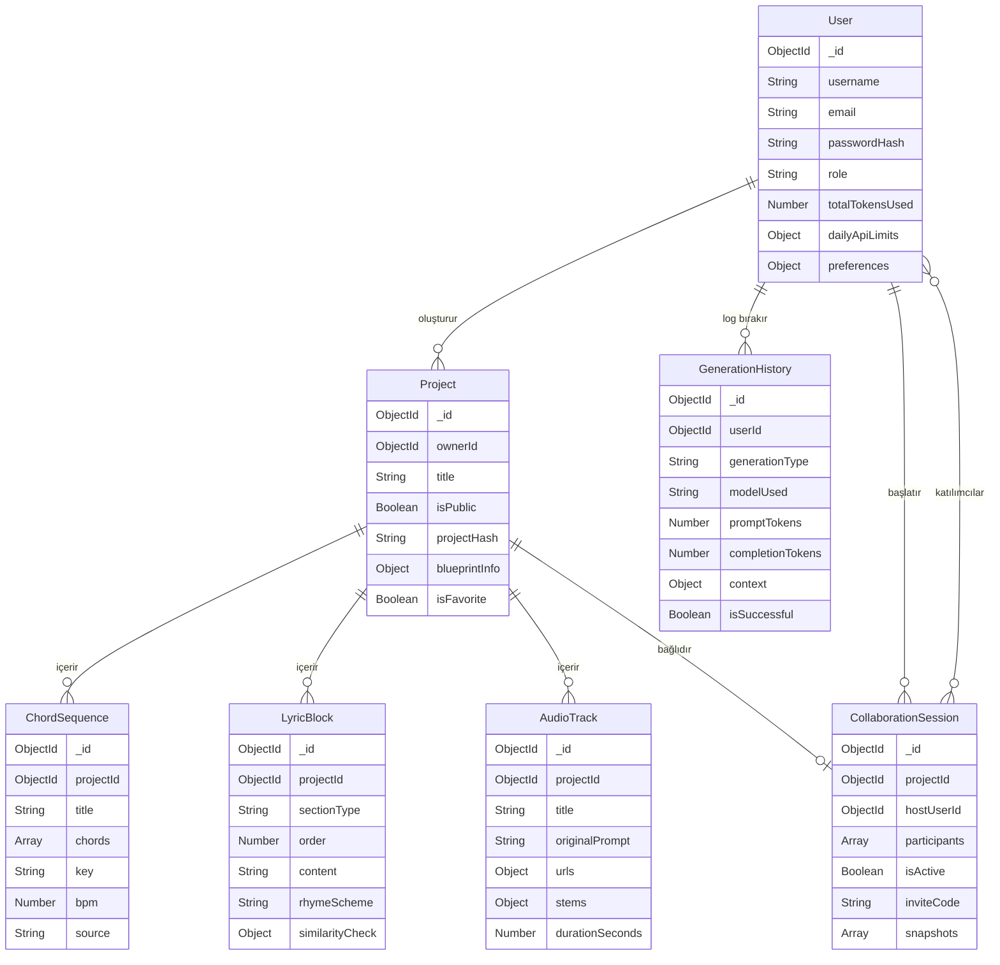

# AuraBeat - Veritabanı Şeması ve Modelleri (MongoDB)

Bu doküman, projede kullanılacak NoSQL (MongoDB) veritabanı koleksiyonlarının mimarisini, veri tiplerini ve aralarındaki ilişkileri (Referanslar) tanımlamaktadır. Veritabanı yönetimi için Node.js ortamında **Mongoose ODM** (Object Data Modeling) kullanılacaktır.

---

## 1. Kullanıcı Koleksiyonu (`User`)

Kullanıcıların temel hesap bilgileri, kimlik doğrulama detayları ve platformu ne kadar kullandıklarına (Token Limitleri vb.) dair kritik finansal veya operasyonel verileri saklar.

```javascript
const UserSchema = new Schema({
  username: { 
    type: String, 
    required: true, 
    unique: true, 
    trim: true,
    minlength: 3
  },
  email: { 
    type: String, 
    required: true, 
    unique: true, 
    lowercase: true 
  },
  passwordHash: { 
    type: String, 
    required: true,
    select: false // Güvenlik: Sorgularda varsayılan olarak dönmez
  },
  role: { 
    type: String, 
    enum: ['user', 'admin', 'premium'], 
    default: 'user' 
  },
  totalTokensUsed: { 
    type: Number, 
    default: 0 
  },
  dailyApiLimits: {
    audioRemaining: { type: Number, default: 5 },  // Günde 5 ses üretimi
    textRemaining: { type: Number, default: 50 },  // Günde 50 AI asistan kullanımı
    lastResetDate: { type: Date, default: Date.now } // Her gece 00:00'da sıfırlama için
  },
  preferences: {
    theme: { type: String, enum: ['light', 'dark', 'system'], default: 'system' },
    language: { type: String, enum: ['tr', 'en'], default: 'tr' }
  }
}, { timestamps: true }); // createdAt ve updatedAt otomatik eklenir
```

---

## 2. Projeler / Ana Dosya Koleksiyonu (`Project`)

Kullanıcının AuraBeat Workspace (Çalışma Alanı) üzerindeki her bir üretim dosyasını temsil eder. Bir projede hem akor, hem ses, hem de şarkı sözü parçaları bir arada durabilir.

```javascript
const ProjectSchema = new Schema({
  ownerId: { 
    type: Schema.Types.ObjectId, 
    ref: 'User', // Hangi kullanıcıya ait olduğu
    required: true 
  },
  title: { 
    type: String, 
    required: true, 
    default: "Yeni Müzik Projesi" 
  },
  isPublic: { 
    type: Boolean, 
    default: false // Paylaşım (UUID linki) açık mı kapalı mı
  },
  projectHash: {
    type: String, 
    unique: true  // Paylaşım için /listen/a1b2c3d4 gibi UUID kodu
  },
  
  // -- İçerik Bilgileri --
  blueprintInfo: {
    genre: { type: String },
    mood: { type: String },
    bpm: { type: Number },
    scale: { type: String }
  },
  
  // -- Bağlı Olan Genere Edilmiş Veriler --
  chordProgressions: [{
    type: Schema.Types.ObjectId, 
    ref: 'ChordSequence'
  }],
  lyrics: [{
    type: Schema.Types.ObjectId, 
    ref: 'LyricBlock'
  }],
  audioGenerations: [{
    type: Schema.Types.ObjectId, 
    ref: 'AudioTrack'
  }],
  
  isFavorite: { 
    type: Boolean, 
    default: false 
  }
}, { timestamps: true });
```

---

## 3. Üretim Tarihçesi ve İstatistik Logları (`GenerationHistory`)

Dinamik Dashboard üzerinde Pasta/Bar grafikleri çizmek ve kullanıcının/adminin AI sistemini nasıl kullandığını takip etmek için tutulan detaylı kayıtlardır (Log Collection).

```javascript
const GenerationHistorySchema = new Schema({
  userId: { 
    type: Schema.Types.ObjectId, 
    ref: 'User', 
    required: true 
  },
  generationType: { 
    type: String, 
    enum: ['blueprint', 'chords', 'lyrics', 'audio', 'stem_separation', 'similarity_check'],
    required: true
  },
  
  // Modelden Dönen Operasyonel Meta Verisi
  modelUsed: { 
    type: String, 
    enum: ['gpt-4-turbo', 'gemini-1.5-pro', 'suno-v3', 'musicgen'],
    required: true
  },
  promptTokens: { type: Number, default: 0 },
  completionTokens: { type: Number, default: 0 },
  executionTimeMs: { type: Number, default: 0 }, // İşlem süresi (performans takibi için)
  
  // Üretimin Bağlamı (Grafikler için gerekli: Hangi türde ne üretti?)
  context: {
    genre: String,
    mood: String
  },
  
  // Çıktı başarılı mı, servis hatası mı aldık? (Admin paneli success rate hesabı)
  isSuccessful: { 
    type: Boolean, 
    default: true 
  },
  errorMessage: { type: String } // Hata varsa kaydedilir
}, { timestamps: true });
```

---

## 4. Gerçek Ses / Audio Dosyaları Koleksiyonu (`AudioTrack`)

Suno veya MusicGen API'den dönen gerçek `.mp3` / `.wav` dosyalarının CDN linklerini ve sesin parçalanmış (Stem Separation) varyasyonlarını tutar.

```javascript
const AudioTrackSchema = new Schema({
  projectId: { 
    type: Schema.Types.ObjectId, 
    ref: 'Project' 
  },
  title: { 
    type: String, 
    default: "Oluşturulan Ses - 1" 
  },
  originalPrompt: { 
    type: String // Modele yollanan gerçek tam metin (Master Prompt)
  },
  
  // CDN Linkleri (AWS S3, Cloudinary veya Suno'nun statik linkleri)
  urls: {
    masterAudio: { type: String, required: true }, // Ana mix dosyası URL'i
    waveformDat: { type: String } // Ekranda çizdirilecek genlik verisi (FFT blob)
  },
  
  // Eğer Stem Ayrıştırması yapıldıysa diğer dosyalar:
  stems: {
    isSeparated: { type: Boolean, default: false },
    vocalUrl: { type: String },
    drumsUrl: { type: String },
    bassUrl: { type: String },
    otherUrl: { type: String }
  },
  
  durationSeconds: { type: Number }
}, { timestamps: true });
```

---

## 5. Akor Zinciri Koleksiyonu (`ChordSequence`)

Projelere bağlı olarak saklanan akor ilerleyişlerini temsil eder. Her bir akor zinciri, AI tarafından üretilmiş veya kullanıcı tarafından manuel oluşturulmuş olabilir.

```javascript
const ChordSequenceSchema = new Schema({
  projectId: {
    type: Schema.Types.ObjectId,
    ref: 'Project',
    required: true
  },
  title: {
    type: String,
    default: "Akor Zinciri - 1"
  },
  chords: [{
    name: { type: String, required: true },         // Örn: "Am", "F", "C", "G"
    duration: { type: Number, default: 1 },          // Beat cinsinden süre
    velocity: { type: Number, default: 80 },         // MIDI velocity (0-127)
    octave: { type: Number, default: 4 }
  }],
  key: { type: String },                             // Tona/Gam: "C Minor", "G Major"
  bpm: { type: Number },
  mood: { type: String },
  source: {
    type: String,
    enum: ['ai_generated', 'user_created', 'ai_suggested'],
    default: 'user_created'
  },
  isExportedAsMidi: { type: Boolean, default: false }
}, { timestamps: true });
```

---

## 6. Şarkı Sözü Blokları Koleksiyonu (`LyricBlock`)

AI tarafından üretilen veya kullanıcı tarafından yazılan şarkı sözü bloklarını saklar. Her blok bir verse, nakarat veya bridge gibi bölümleri temsil edebilir.

```javascript
const LyricBlockSchema = new Schema({
  projectId: {
    type: Schema.Types.ObjectId,
    ref: 'Project',
    required: true
  },
  sectionType: {
    type: String,
    enum: ['verse', 'chorus', 'bridge', 'pre-chorus', 'outro', 'intro', 'hook', 'freestyle'],
    default: 'verse'
  },
  order: { type: Number, default: 0 },                // Blok sırası (sözlerin dizilimi)
  content: { type: String, required: true },           // Söz metni
  language: { type: String, enum: ['tr', 'en'], default: 'tr' },
  
  // AI üretim meta verileri
  rhymeScheme: { type: String },                       // "AABB", "ABAB", vb.
  syllableCount: { type: Number },
  source: {
    type: String,
    enum: ['ai_generated', 'user_written', 'ai_rewritten'],
    default: 'user_written'
  },
  
  // Benzerlik kontrolü sonuçları
  similarityCheck: {
    isChecked: { type: Boolean, default: false },
    similarityScore: { type: Number },                 // 0.0 - 1.0 arası
    matchedSong: { type: String }                      // Benzer bulunan şarkı adı (varsa)
  }
}, { timestamps: true });
```

---

## 7. Ortak Çalışma Oturumları Koleksiyonu (`CollaborationSession`)

Real-time collaboration (WebSocket) için oluşturulan oturumların kaydını tutar. Birden fazla kullanıcının aynı projede eş zamanlı çalışmasını yönetir.

```javascript
const CollaborationSessionSchema = new Schema({
  projectId: {
    type: Schema.Types.ObjectId,
    ref: 'Project',
    required: true
  },
  hostUserId: {
    type: Schema.Types.ObjectId,
    ref: 'User',
    required: true
  },
  participants: [{
    userId: { type: Schema.Types.ObjectId, ref: 'User' },
    role: { type: String, enum: ['editor', 'viewer'], default: 'editor' },
    joinedAt: { type: Date, default: Date.now }
  }],
  isActive: { type: Boolean, default: true },
  inviteCode: {
    type: String,
    unique: true                                       // Benzersiz davet kodu (UUID)
  },
  
  // Sürüm geçmişi (basit snapshot sistemi)
  snapshots: [{
    label: { type: String },
    data: { type: Schema.Types.Mixed },                // O anki proje verisi (JSON)
    createdBy: { type: Schema.Types.ObjectId, ref: 'User' },
    createdAt: { type: Date, default: Date.now }
  }]
}, { timestamps: true });
```

---

## İndeksleme (Index) Önerileri

Sorgu performansını artırmak için aşağıdaki indeksler önerilir:

```javascript
// User — e-posta ile hızlı login sorgusu
UserSchema.index({ email: 1 }, { unique: true });

// Project — kullanıcıya ait projeleri hızlı listeleme
ProjectSchema.index({ ownerId: 1, createdAt: -1 });

// GenerationHistory — dashboard grafikleri için
GenerationHistorySchema.index({ userId: 1, createdAt: -1 });
GenerationHistorySchema.index({ userId: 1, generationType: 1 });

// AudioTrack — projeye bağlı ses dosyalarını listeleme
AudioTrackSchema.index({ projectId: 1 });

// ChordSequence — projeye bağlı akor zincirleri
ChordSequenceSchema.index({ projectId: 1 });

// LyricBlock — projeye bağlı söz blokları (sıralı)
LyricBlockSchema.index({ projectId: 1, order: 1 });

// CollaborationSession — aktif oturumları hızlı sorgulama
CollaborationSessionSchema.index({ projectId: 1, isActive: 1 });
CollaborationSessionSchema.index({ inviteCode: 1 }, { unique: true });
```

---

## Veritabanı İlişkileri (ERD Diyagramı)



*Not: Veritabanında hız kazanmak ve sorguları kısaltmak amacıyla `GenerationHistory` gibi devasa boyutlara ulaşabilen (Append-Only) metrik/log koleksiyonları, ana projeden ayrılarak bağımsız yapılandırılmıştır.*
